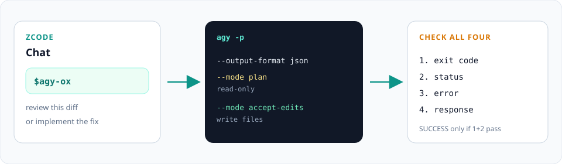
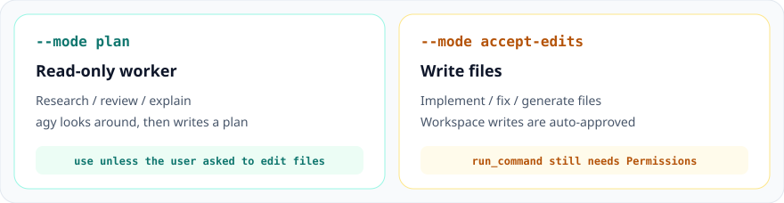

<p align="center"></p>

<p align="center">
  <a href="README.md">English</a> ·
  <a href="README.zh-CN.md">简体中文</a>
</p>

<p align="center">
  <a href="https://zcode.z.ai/docs/plugin"></a>
  <a href="https://antigravity.google/docs/cli/headless/"></a>
  <a href="LICENSE"></a>
</p>

# agy-ox

把本机 [Google Antigravity CLI](https://antigravity.google/docs/cli/using/)（`agy`）雇成 **ZCode** 的 headless 工人。

Marketplace、插件、Skill、斜杠命令全部叫 **agy-ox**。

ZCode 加载一个 Skill 和一个命令，Agent 直接跑官方 `agy -p`。没有 companion、没有后台任务队列、没有多角色模板。



**[安装](#在-zcode-里一键导入) · [行为](#行为约定) · [目录](#目录)**

## 在 ZCode 里一键导入


ZCode 没有独立的 Skill 商店。Skill 要打成插件，再通过 marketplace 分发。本仓库根目录的 `marketplace.json` 就是这份目录。

1. 先打开任意工作区。
2. **设置 → 插件 → Discover → 右上角 `+` → Add marketplace**。
3. 填入：

```text
Yuuqq/agy-ox
```

   完整 URL `https://github.com/Yuuqq/agy-ox` 也可以。
4. 在 **agy-ox** marketplace 里，对 **agy-ox** 插件点 **Get / Install**。新安装的插件默认启用。

然后在对话里：

```text
$agy-ox 审查当前工作区的 diff
```

```text
/agy-ox 按我们刚说的范围把这个重试 bug 修掉
```

输入 `/` 也能在 Skills 分组里找到它。

### 本地目录（不经过 GitHub）

**设置 → 插件 → Discover → `+`**，选择本仓库的本地路径。ZCode 会校验根目录的 `marketplace.json`。

## 行为约定



| 用户意图 | 官方参数 | 说明 |
| --- | --- | --- |
| 调研、审查、解释、出方案 | `--mode plan` | 只读摸底，先出计划 |
| 实现 / 修复 / 改文件 | `--mode accept-edits` | 自动批准工作区内写文件 |
| 推理强度 | `--effort low\|medium\|high` | 只允许这三个值 |
| 回收结果 | `--output-format json` | 必须同时检查退出码、`status`、`error`、`response` |

默认**不会**加 `--dangerously-skip-permissions`。`accept-edits` 不会自动放行 `run_command`，shell 仍走 [Permissions](https://antigravity.google/docs/cli/permissions/)。

Skill 依据的官方文档：

- [Using AGY CLI](https://antigravity.google/docs/cli/using/)
- [Headless mode](https://antigravity.google/docs/cli/headless/)
- [Choose an execution mode](https://antigravity.google/docs/cli/modes/)
- [Permissions](https://antigravity.google/docs/cli/permissions/)

## 前置条件

ZCode 所用的那台机器上已经安装并登录 `agy`：

```bash
agy --version
```

没有命令时，按 [Installation & Auth](https://antigravity.google/docs/cli/install) 自行安装。本插件不会代装。

## 目录

```text
.
├── marketplace.json           # ZCode marketplace 清单（仓库根目录）
└── plugins/agy-ox/
    ├── .zcode-plugin/plugin.json
    ├── commands/agy-ox.md     # /agy-ox
    └── skills/agy-ox/SKILL.md # $agy-ox
```

插件里的 Skill 必须是扁平的 `skills/<name>/SKILL.md`，不能再套一层分组目录。

## 和 agy-staff 的差别

[agy-staff](https://github.com/keli-wen/agy-staff) 是给 Claude Code / Codex / Pi 用的完整插件：多角色、Node companion、后台 job。**agy-ox** 是给 ZCode 的薄路径：直接调官方 `agy -p`，解析 JSON。

## 许可证

MIT
